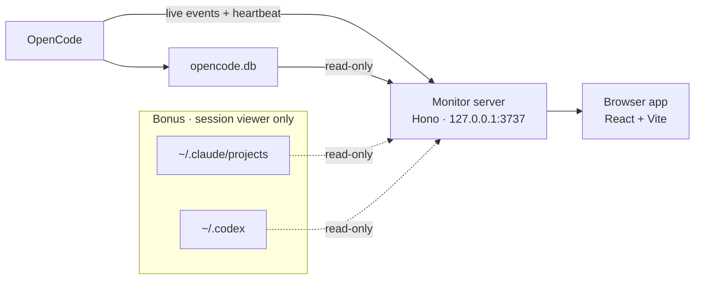

<div align="center">

# OpenCode Observability

**Local-first observability for OpenCode.**
A live monitor, dashboard, and session viewer for your OpenCode runs — entirely on `127.0.0.1`. 🛰️

<br/>

[](https://github.com/abekdwight/opencode-observability/actions/workflows/ci.yml)
[](#-license)
[](https://nodejs.org)
[](https://www.typescriptlang.org)
[](https://react.dev)
[](https://hono.dev)

[Features](#-features) · [Quick Start](#-quick-start) · [Integrations](#-integrations) · [Pages](#-whats-inside) · [Architecture](#-architecture) · [Privacy](#-privacy--safety)

</div>

---

**OpenCode Observability** turns the session history OpenCode already writes to disk into a fast, local dashboard. It runs a single monitor server on your machine, reads OpenCode's session store **read-only**, and streams live activity into a browser UI. Nothing is sent to the cloud — there is no account, no external endpoint, and no data ever leaves `localhost`.

> **OpenCode is the focus.** The live monitor and dashboard are built around OpenCode. Because the session viewer happens to be harness-agnostic, **Claude Code** and **Codex** sessions can be browsed in the same UI too — a bonus, not the main event.

```bash
npx opencode-observability
# → open http://127.0.0.1:3737
```

## ✨ Features

- 🛰️ **Live Monitor** — every open OpenCode session as a card with an inline real-time timeline (last 5 minutes), so you can spot a stuck agent, a retry storm, or an error the moment it happens.
- 📊 **Dashboard** — token consumption, model performance, MCP usage, error patterns, subagent trends, and an activity heatmap across your OpenCode sessions.
- 🔍 **Session Viewer** — replay any past conversation with full Markdown rendering, [Shiki](https://shiki.style/) syntax highlighting (17 languages), and live Mermaid diagrams.
- 🔌 **Zero-setup plugin** — the OpenCode plugin streams live events and auto-starts the monitor, so there's no server to babysit.
- 🔒 **Local by design** — read-only access to your existing session store, a metadata-only live boundary, and no raw payloads exposed to the browser.
- ➕ **Bonus — Claude Code & Codex** — the same viewer also opens Claude Code and Codex sessions, each with a `/monitor` command handled by a hook **before the model runs** (zero token cost).

## 🚀 Quick Start

Requires **Node.js ≥ 22**.

```bash
# Run the monitor with no install
npx opencode-observability

# …or install globally
npm install -g opencode-observability
opencode-observability
```

The server starts at **http://127.0.0.1:3737** and opens on the live **Monitor**. It immediately reads whatever OpenCode history already exists on your machine — no configuration required.

## 🧩 Integrations

### OpenCode

Add the plugin to your OpenCode config (`opencode.json` or `~/.config/opencode/opencode.json`):

```json
{
  "$schema": "https://opencode.ai/config.json",
  "plugin": ["opencode-observability"]
}
```

The plugin streams live session events and heartbeats to the monitor. If the monitor isn't running yet and the ingest target is local, the plugin **auto-starts a single shared server** with a lock — so multiple OpenCode processes share one monitor instead of spawning duplicates.

### Bonus: Claude Code & Codex

OpenCode is the focus, but since the viewer is harness-agnostic this repo also ships marketplace plugins that add a `/monitor` command to Claude Code and Codex, opening the **current** session in the viewer. Each hook runs **before the model**, so it costs **zero tokens**.

**Claude Code**

```text
/plugin marketplace add abekdwight/opencode-observability
/plugin install opencode-observability@opencode-observability
```

**Codex**

```text
codex plugin marketplace add abekdwight/opencode-observability
codex plugin add opencode-observability@opencode-observability
```

Run `/monitor` (Codex also exposes it as the `@monitor` skill). Plugin hooks need a one-time trust approval on first use. The viewer server must already be running (`npx opencode-observability`); otherwise the hook explains how to start it. Hook scripts use only the Python 3 standard library.

## 🗺️ What's Inside

| Page | Route | Scope | What it shows |
| --- | --- | --- | --- |
| **Monitor** | `/monitor` | OpenCode | Live cards for every open session with an inline activity timeline. Real-time, in-memory only. |
| **Dashboard** | `/dashboard` | OpenCode | Aggregated metrics: tokens, models, MCP usage, errors, subagents, and activity heatmap. |
| **Search** | `/search` | OpenCode | Search across session content. |
| **Sessions** | `/sessions` | OpenCode · Claude Code · Codex | Browse and open historical sessions across every detected harness. |
| **Session Detail** | `/sessions/:harness/:id` | OpenCode · Claude Code · Codex | Full conversation replay with Markdown, syntax highlighting, and Mermaid diagrams. |

**Timeline lanes** on the Monitor stack activity by operator-facing category, so degradation is visible at a glance:

🩶 `activity` — status/updates · 🔵 `subagent` — subagent launches · 🟠 `pressure` — compaction, retries, warnings · 🔴 `failure` — errors needing intervention

## ⚙️ Configuration

Every option has a sensible default — the table below is for tuning. Copy `.env.example` to get started.

| Variable | Default | Description |
| --- | --- | --- |
| `PORT` | `3737` | Server listen port. |
| `HOST` | `127.0.0.1` | Server listen host. |
| `OPENCODE_DB_PATH` | `~/.local/share/opencode/opencode.db` | OpenCode session database. |
| `CODEX_STATE_DB_PATH` | `~/.codex/state_5.sqlite` | Codex state database. |
| `CLAUDE_PROJECTS_DIR` | `~/.claude/projects` | Claude Code session transcripts. |
| `OPENCODE_MONITOR_HEARTBEAT_TTL_MS` | `90000` | Grace period before an idle source is dropped. |
| `OPENCODE_MONITOR_INGEST_TOKEN` | _(unset)_ | If set, ingest requires `Authorization: Bearer <token>`. |
| `OPENCODE_OBSERVABILITY_AUTOSTART` | `1` | Let the OpenCode plugin auto-start the monitor. Set `0` to disable. |
| `OPENCODE_OBSERVABILITY_URL` | `http://127.0.0.1:3737` | Viewer base URL used by the Claude Code / Codex hooks. |

## 🏗️ Architecture



The **live Monitor**, **Dashboard**, and **Search** are driven entirely by OpenCode — the plugin's ingest stream plus a read-only connection to `opencode.db`. The **session viewer** additionally reads Claude Code and Codex stores through a harness-adapter layer that normalizes all three formats behind one contract, so the UI never depends on a vendor's raw shape.

```text
src/
├─ server/         Hono read-only API, ingest aggregator, app-shell delivery
├─ services/       Aggregation, view models, and per-harness adapters
│  └─ harness/     opencode · claude · codex adapters
├─ repositories/   SQL access
├─ contracts/      Browser-facing data contracts
└─ lib/            Config, db, formatting
web/               React + Vite app shell (Tailwind, Radix UI, Recharts)
```

**Stack:** TypeScript · [Hono](https://hono.dev) · [React 19](https://react.dev) + [Vite](https://vite.dev) · better-sqlite3 · [Tailwind CSS](https://tailwindcss.com) · [Radix UI](https://www.radix-ui.com) · [Shiki](https://shiki.style) · [Mermaid](https://mermaid.js.org) · [Recharts](https://recharts.org).

## 🔒 Privacy & Safety

- **Local only.** The server binds to `127.0.0.1` and reads your existing session stores read-only. No telemetry leaves your machine.
- **Metadata boundary.** Live timeline events carry only metadata (status, category, level, counts) — never message bodies, prompts, tool arguments, or stack traces.
- **No raw payloads.** Browser-facing contracts never expose raw upstream data.
- **Safe rendering.** Markdown is rendered without raw HTML; diffs are escaped.
- **Guarded deletes.** Destructive actions are re-validated server-side against a confirmation header.

## 🛠️ Development

```bash
npm ci
npm run dev        # build the app shell, then start the server with hot reload
npm run build      # production build (server + app)
npm run lint       # Biome
npm run typecheck  # tsc
npm run test       # Vitest
npm run test:e2e   # Playwright
```

See [CONTRIBUTING.md](./CONTRIBUTING.md) for route ownership rules, fixtures, and validation steps.

## 📄 License

Released under the [MIT License](https://opensource.org/licenses/MIT).
